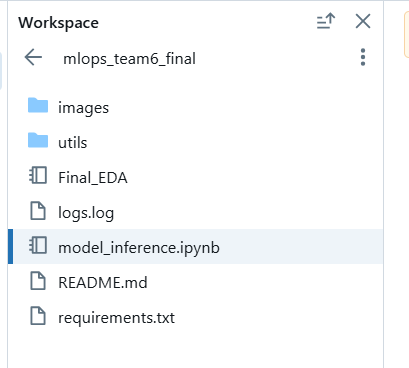
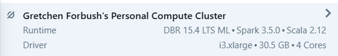
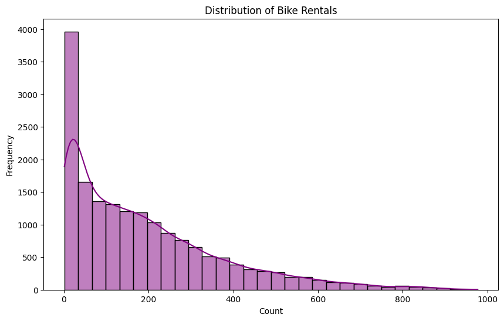
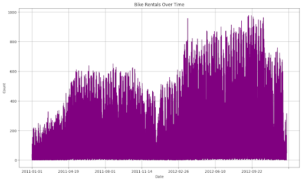
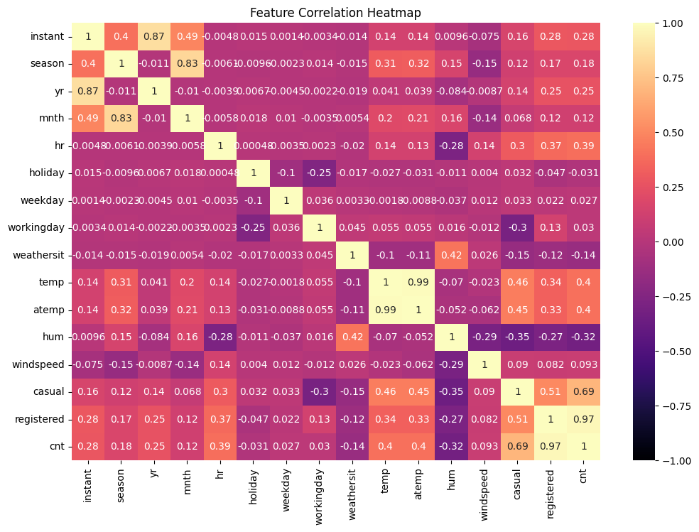
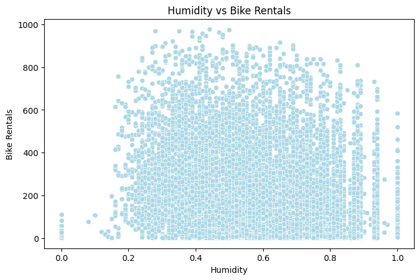
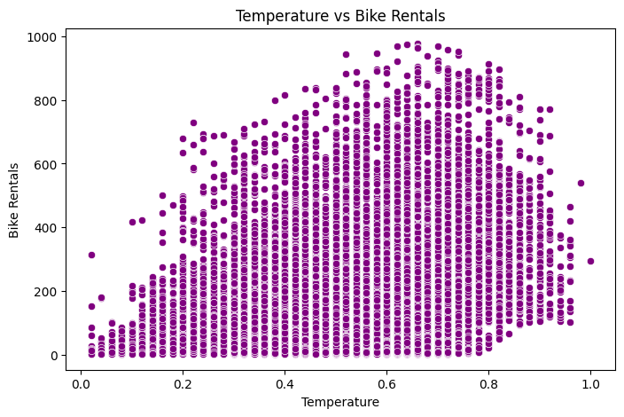
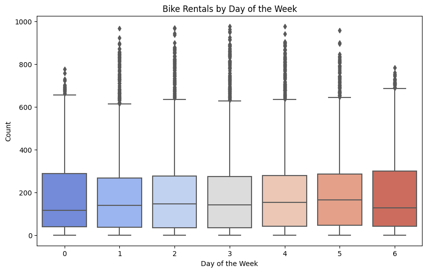
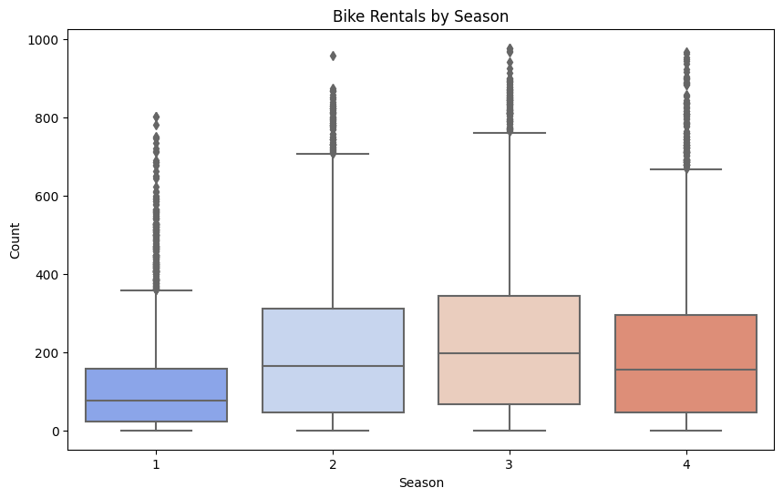

<!-- PROJECT SHIELDS -->
<!-- PROJECT LOGO -->
 

  

<h3 align="center">MLOps Final - Team 6</h3>

  

    University of Chicago MSADS MLOps (ADSP 32021) AU2024 Final Project
     
    <a href="https://github.com/forbug/mlops_team6_final"><strong>Explore the docs »</strong></a>
     
     
    <a href="https://github.com/forbug/mlops_team6_final">View Demo</a>
    ·
    <a href="https://github.com/forbug/mlops_team6_final/issues/new?labels=bug&template=bug-report---.md">Report Bug</a>
    ·
    <a href="https://github.com/forbug/mlops_team6_final/issues/new?labels=enhancement&template=feature-request---.md">Request Feature</a>
  

<!-- TABLE OF CONTENTS -->

  
Table of Contents

  <ol>
    <li>
      <a href="#about-the-project">About The Project</a>
    </li>
    <li>
      <a href="#getting-started">Getting Started</a>
    </li>
    <li><a href="#roadmap">Usage</a></li>
    <li><a href="#data-pipeline">Data Pipeline</a></li>
    <li><a href="#model-deployment-&-monitoring">Model Deployment & Monitoring</a></li>
    <li><a href="#license">License</a></li>
    <li><a href="#contact">Contact</a></li>
    <li><a href="#acknowledgements">Acknowledgments</a></li>
  </ol>

<!-- ABOUT THE PROJECT -->
## 🚲 About The Project

Demonstrating MLOps best practices through a bike-share machine learning model use case. The pipeline is deployed on Databricks, leveraging its robust capabilities for seamless orchestration and scalability. This project showcases the end-to-end workflow, from data ingestion to deployment, emphasizing automation, reproducibility, and efficient collaboration.

(<a href="#readme-top">back to top</a>)

<!-- GETTING STARTED -->
## ⚙️ Getting Started

In order to run this project and leverage all of the intended features, the repository must be housed in a *Databricks* workspace. In order to set up the folders properly, you must follow the following instructions:
1. [Configure your databricks/git credentials.](https://docs.databricks.com/en/repos/repos-setup.html)
2. [Create a git folder inside a databricks workspace using the repo URL.](https://docs.databricks.com/en/repos/git-operations-with-repos.html)

Once your repository has been set up in *Databricks*, open the repository and select `model_inferencing.ipynb`

Ensure that you have an instance running with the following specifications:

The, select the **Run All** button in the top right-hand corner of the workspace and watch the inferencing begin!

(<a href="#readme-top">back to top</a>)

<!-- ROADMAP -->
## 🔀 Roadmap

This section outlines the key steps and outcomes of the analysis, showcasing how the project can be applied effectively. Screenshots, code examples, and visualizations are included to provide a comprehensive understanding of the workflow. Additional resources and documentation links are provided where applicable.

- ### Exploratory Data Analysis (EDA) and Insights
  This phase focuses on uncovering patterns and trends in the data. Key visualizations and statistical summaries are presented to provide a clear understanding of the dataset. Screenshots and plots highlight relationships, distributions, and potential anomalies.

  **Distribution of Bike Rentals :**
    The majority of bike rental counts are relatively low, with a right-skewed distribution suggesting occasional higher rental counts. This highlights the presence of outliers or peak demand periods.

    

    
    

  **Bike Rentals Over Time:**
  The time series plot shows seasonality and trends in bike rentals, with higher counts observed during warmer months, reflecting fluctuations in demand potentially driven by weather or other temporal factors.

    

    
    

  **Feature Correlation Heatmap :** Provides insights into the relationships between variables in the dataset. This heatmap helps identify features that significantly impact the target variable, aiding in feature selection for modeling.

  *Key observations :*

    - strong positive correlation between “cnt” (the target variable) and both “registered” and “casual” users

    - Moderate positive correlation with “temp” and “atemp”.

    - Negative correlations with features like “hum” and “windspeed” suggest these factors might negatively influence bike rentals.
 
    

    
    

  **Humidity vs. Bike Rentals:** 
  The scatter plot shows no strong linear relationship between humidity and bike rentals, but higher humidity levels might slightly reduce rental counts.

    

    
    

  **Temperature vs. Bike Rentals:** 
  The scatter plot reveals a positive relationship between temperature and bike rentals, with higher rental activity observed as temperatures increase, up to a certain threshold.

    

    
    

  **Bike Rentals by Day of the Week:**
  The boxplot shows relatively consistent bike rental distributions across the days of the week, with slightly higher counts observed on weekends (days 5 and 6), suggesting increased leisure activity during these days.

    

    
    

  **Bike Rentals by Season:**
  The boxplot highlights higher bike rentals in fall (season 3) and summer (season 2), while spring (season 1) and winter (season 4) show lower counts, likely due to less favorable weather conditions during these seasons.

    

    
    

<!-- DATA PIPELINE -->
## 📊 Data Pipeline

  The data pipeline streamlines the entire process from data ingestion to preprocessing and feature engineering, ensuring efficiency and accuracy. To showcase its architecture, we’ve included detailed screenshots and diagrams that emphasize its scalability and robustness. Databricks was selected for     pipeline orchestration due to its powerful capabilities and suitability for our requirements.

  
  #### **Key Components:**

  - Data Cleaning & Preprocessing: Ensuring data quality and consistency.
  
  - Parallelized Model Training: Accelerating training with distributed computing.
  
  - Hyperparameter Tuning: Optimizing model performance.
  
  - Model Selection: Identifying the best-performing model.
  
  - Experiment Logging: Tracking and managing experiments for reproducibility and analysis.
  
  This approach ensures a seamless, efficient, and reliable pipeline tailored for robust machine learning workflows.

  #### **Databricks Features:**
  
  *Databricks* provides the following features:

  - Low-code/no-code interface via UI or Python API

  - Generates EDA & trial notebooks

  - Integration with Databricks feature store and MLflow

  - Configurable evaluation metrics

  - Includes code for explainability via SHAP plots

  - Automatically balances imbalance datasets

<!-- MODEL DEPLOYMENT & MONITORING -->
## 🗂️ Model Deployment & Monitoring

  This section demonstrates how the model is deployed in a production environment. Monitoring tools and dashboards track performance metrics and ensure the model's reliability over time. Screenshots provide a visual guide to the monitoring process.

  Tracking the perfomance of different models within Databrick's user interface:
  

<!-- VALIDATION & FEATURE ADJUSTMENTS -->
## ✅ Validation & Feature Adjustments
  Validation metrics, such as RMSE, and MAE are presented to evaluate model performance. This section also includes examples of changes made based on feedback or updated data, showcasing the iterative improvement process.

### Feature Adjustments

- **Temperature (temp):**  
  The temperature feature was modified by increasing its values by 20%. This adjustment was implemented to test the model's resilience to significant changes in environmental conditions that might impact predictions.

- **Windspeed (windspeed):**  
  The windspeed feature was adjusted by decreasing its values by 20%. This change was introduced to evaluate the model's ability to maintain performance under altered conditions in this feature.

  Image below shows the changes in the model metrics both before and after applying the feature adjustments: 

  

### Validation Results

After adjusting the features, the model's robustness was thoroughly tested. While the model remained largely robust to these feature changes, a slight decline in performance was observed. Specifically:

- The 20% increase in **temperature** introduced minor variations in the prediction accuracy.  
- Similarly, the 20% decrease in **windspeed** led to marginal impacts on the model's outputs.

Overall, the model demonstrated resilience, maintaining reasonable performance even under modified feature conditions. This indicates that the model's generalization capabilities are adequate for scenarios with moderate environmental variability. However, further fine-tuning or feature scaling might be considered to enhance robustness to larger fluctuations in key features like temperature and windspeed.
  

(<a href="#readme-top">back to top</a>)

<!-- CONTACT -->
## 📩 Contact

Gretchen Forbush - forbug@uchicago.edu 

Forough Mofidi - fmofidi@uchicago.edu

Zainab Sunny - zainab786@uchicago.edu

Project Link: [https://github.com/forbug/mlops_team6_final](https://github.com/forbug/mlops_team6_final)

(<a href="#readme-top">back to top</a>)

<!-- ACKNOWLEDGMENTS -->
## Acknowledgments
This project was completed as the final project for the MLOps course in UChicago's Master's in Applied Data Science curriculum in Fall 2024. Thank you to Arnab Bose, our professor, and Kshitij Mittal, our TA, for your teaching and guidance!

(<a href="#readme-top">back to top</a>)

